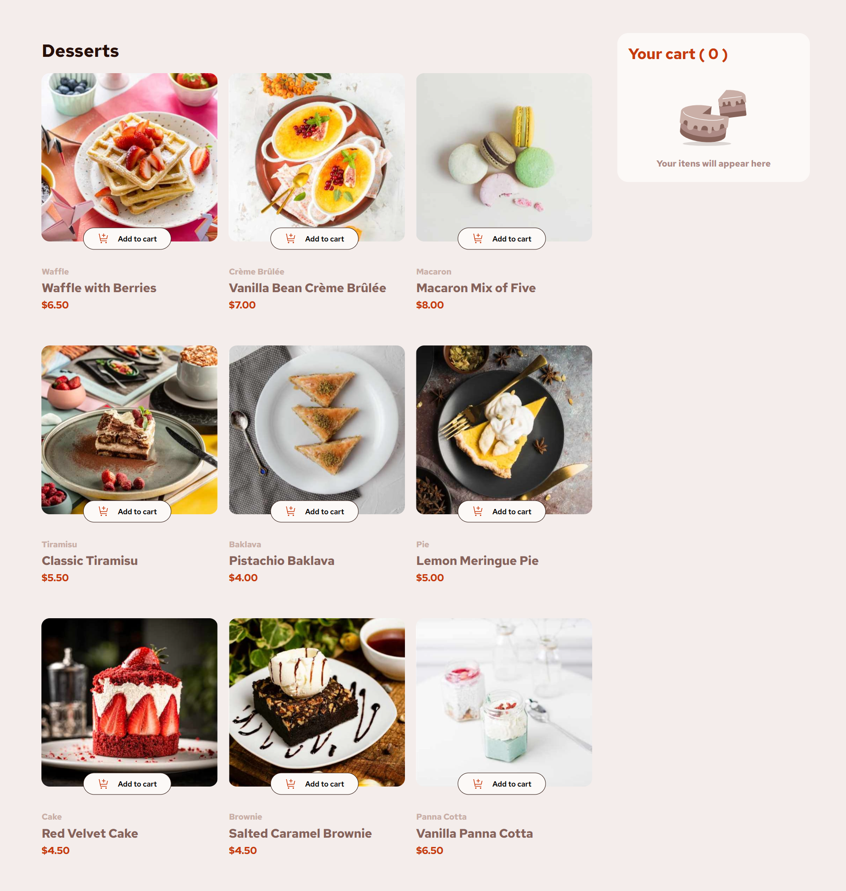

# Frontend Mentor - Product list with cart solution

This is a solution to the [Product list with cart challenge on Frontend Mentor](https://www.frontendmentor.io/challenges/product-list-with-cart-5MmqLVAp_d). Frontend Mentor challenges help you improve your coding skills by building realistic projects. 

## Table of contents

- [Overview](#overview)
  - [The challenge](#the-challenge)
  - [Screenshot](#screenshot)
  - [Links](#links)
- [My process](#my-process)
  - [Built with](#built-with)
  - [What I learned](#what-i-learned)
  - [Continued development](#continued-development)
- [Author](#author)

## Overview

### The challenge

Users should be able to:

- Add items to the cart and remove them
- Increase/decrease the number of items in the cart
- See an order confirmation modal when they click "Confirm Order"
- Reset their selections when they click "Start New Order"
- View the optimal layout for the interface depending on their device's screen size
- See hover and focus states for all interactive elements on the page

### Screenshot

### Links

- Solution URL: [Add solution URL here](https://github.com/Avantiermv/product-list-with-cart-main)
- Live Site URL: [Add live site URL here](https://avantiermv.github.io/product-list-with-cart-main/)

## My process

### Built with

- Semantic HTML5 markup
- JavaScript properties
- CSS custom properties
- Flexbox
- Mobile-first workflow

### What I learned

What I learned: I improved my knowledge of some aspects of javascript, for example, the use of json files, functions, arrow functions and addEventListeners. BUT, I need to study a lot more. Analyzing other codes, I realized that my code has some problems to be solved. 

### Continued development

I need to study more about design patterns, functional programming, event delegation, web components and code organization.

## Author

- Frontend Mentor - [@avantiermv](https://github.com/Avantiermv)

